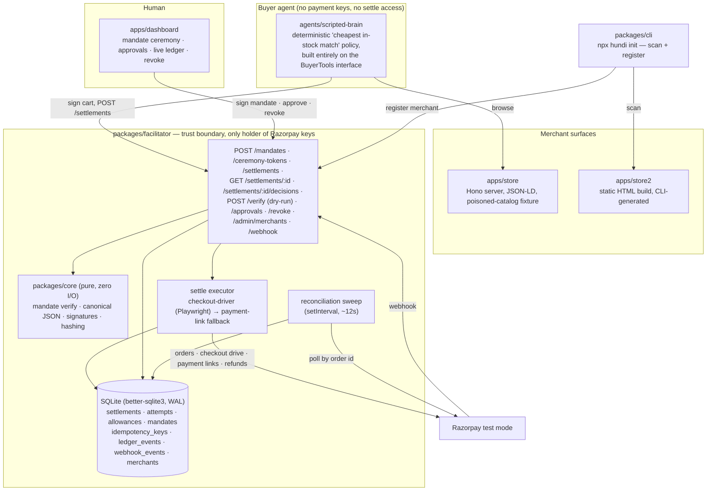
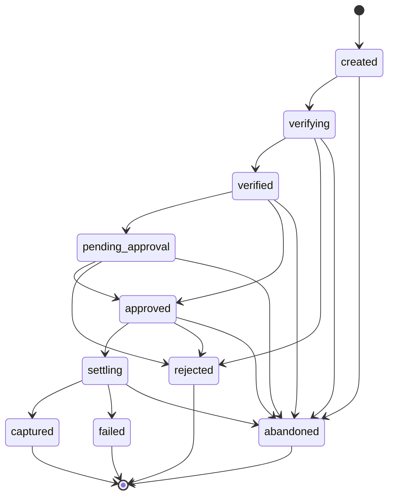
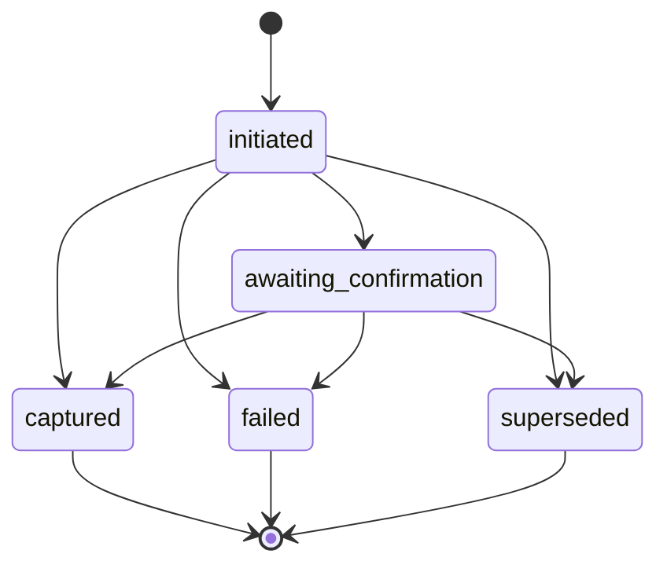
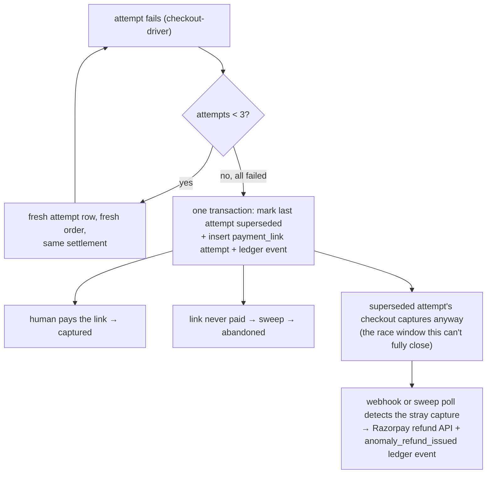

# Architecture

## Component topology and the trust boundary

The facilitator is the only process that ever holds Razorpay credentials.
Buyer agents talk to the store and to the facilitator's agent-facing
endpoints; neither surface gives them anything that touches Razorpay
directly.

`packages/core` has zero runtime dependencies beyond signature/hash
primitives and is imported by both the facilitator and every agent —
verification logic exists in exactly one place, and both sides of a
mandate exchange run the identical check.

## Settlement state machine

One settlement row moves through a fixed set of states; every transition
is a compare-and-swap (`UPDATE ... WHERE id = ? AND state = ?`), so a
concurrent writer that loses the race gets a distinguishable
`StaleTransition` rather than silently clobbering the other writer's
result. This is the literal transition table enforced in
`packages/facilitator/src/state-machine.ts`.

`created`/`verifying` are normally crossed synchronously inside the
request that creates the settlement; a row observed sitting in either is a
stranded transient from a crashed request, which is why both allow a
direct path to `abandoned` for the sweep. `approved → settling` re-runs
the *full* verify chain (revocation, expiry, hash-link) inside the same
transaction as the CAS — an approval can be minutes old by the time a
queued kick actually runs, and a mandate revoked in that window must be
caught before any money moves, not just at creation time.

**Attempts** (`settlement_attempts`, one row per payment try):

A retry is a new attempt row (max 3 checkout-driver attempts per
settlement); the fallback to a payment link is a new row with
`method = 'payment_link'`. The write is write-ahead: the attempt row
(with its own `receipt`) commits *before* the Razorpay order-create call,
so a crash between the two still leaves a durable record that an attempt
was made — the sweep converges an orphaned `initiated` row with no
provider order id to `failed` on its own, since only the executor is
allowed to create provider artifacts.

## Allowance lifecycle

| Phase | Trigger | Effect |
|---|---|---|
| issued | mandate registered | allowance row, 1:1 with the mandate |
| reserved | settlement created | one non-terminal settlement per allowance (DB-enforced) |
| consumed | attempt captured | terminal — mandate is spent |
| released | settlement rejected/failed/abandoned | allowance usable again |

## `/verify` rejection matrix

`packages/core/src/verify.ts` runs a fixed sequence of checks and returns
the *first* failure — a forged signature is reported before a stale
price, even when both are true. Every code below is a named branch in
that function, each covered by its own test:

`SCHEMA_INVALID` · `MANDATE_UNKNOWN` · `SIG_INVALID_INTENT` ·
`HASH_LINK_MISMATCH` · `AGENT_KEY_MISMATCH` · `SIG_INVALID_CART` ·
`LINE_ITEM_INVALID` · `PRICE_MISMATCH` · `CURRENCY_MISMATCH` ·
`AMOUNT_EXCEEDS_CEILING` · `MERCHANT_NOT_IN_SCOPE` · `MANDATE_EXPIRED` ·
`MANDATE_REVOKED` · `ALLOWANCE_RESERVED` · `ALLOWANCE_CONSUMED` ·
`DUPLICATE_CART`

Three more codes live at the route layer, guarding the human-facing
actions rather than the agent-facing cart gate: `APPROVAL_SIG_INVALID`
and `CART_HASH_MISMATCH` (`POST /approvals`, which recomputes the hash
from the stored mandate+cart rather than trusting the caller's copy) and
`REVOKE_SIG_INVALID` (`POST /revoke`). `MANDATE_UNKNOWN` resolves the
signing key from the facilitator's own registered-credential store — never
from the request payload — so a self-signed, never-registered mandate
fails here regardless of how well-formed it looks.

## Failure-recovery fork

The DB-level supersede (H's precondition) is atomic and enforced by a
partial unique index on `≤1 captured attempt per settlement` — the
compensator can never be *fooled* into thinking two captures are fine.
What it cannot do is *prevent* the provider-side race: this build does not
call Razorpay to cancel a superseded attempt's underlying order, so if
that dead path captures anyway, it is detected and refunded, not stopped
before it happens. `handleProviderCapture` (`packages/facilitator/src/reconcile.ts`)
is the single authority both the webhook route and the sweep call into for
this — a capture event is only ever "the expected confirmation of the live
attempt" or "an anomaly to refund," decided from current DB state, never
trusted from the event itself. The same function also catches the
cross-settlement variant: an abandoned settlement's unpaid link capturing
late, after a second settlement for the same cart has already captured
under the freed allowance — tested directly (`reconcile.test.ts`,
"cross-settlement variant").

## Reconciliation sweep

One timer-driven process owns every timeout in the system
(`packages/facilitator/src/sweep.ts`); nothing else times a settlement out,
and the sweep itself never creates a Razorpay order or link — only the
executor does. Each rule is independently idempotent (a second pass on an
already-converged row no-ops):

| Stuck state | Sweep action |
|---|---|
| `created`/`verifying` past its TTL | abandon (stranded transient) |
| `verified` past its TTL | abandon |
| `pending_approval` past `min(fixed TTL, mandate expiry)` | abandon (`approval_timeout`) |
| `approved` past its TTL | re-kick the executor's CAS entry, up to a kick budget, then abandon |
| `settling` with no live attempt | re-kick the executor's retry entry point |
| an `initiated`/`awaiting_confirmation` attempt past its TTL | poll Razorpay by order id and converge; an `initiated` attempt with no order id yet is failed outright (the process crashed before the provider call) |
| a locked idempotency key with no stored response, past its TTL | clear the lock |

Webhooks are treated strictly as hints that trigger the same reconcile
path the sweep uses — a forged or replayed webhook body can, at worst,
trigger one harmless reconcile call; it can never move money on its own,
because reconcile always re-fetches the order's payments from Razorpay
before touching any state.

## Where we deliberately did not use AI

The entire money path — mandate verification, state transitions, threshold
routing, capture, the refund compensator — is deterministic code with no
model call anywhere in it. The one place a model (or, in this build, a
scripted stand-in for one) participates is upstream of all of that: picking
which product satisfies a goal. `agents/scripted-brain` is a deliberately
"dumb" policy — cheapest in-stock match under a price filter — built
entirely on the `BuyerTools` interface, which has no settle, capture, or
refund method on it at all. A brain built on that interface cannot reach a
payment provider regardless of what runs inside its decision loop; that is
a property of the type, not a rule the brain implementation has to remember
to follow. An LLM-driven brain (Claude tool loop) sits behind the exact
same interface and is future work — swapping it in changes nothing about
what the facilitator does with the cart it produces, which is the whole
point of drawing the boundary there.
